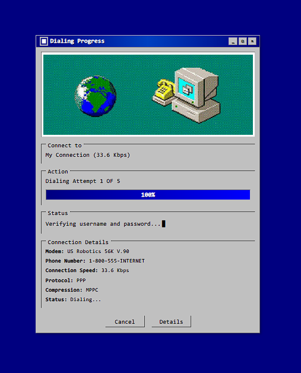
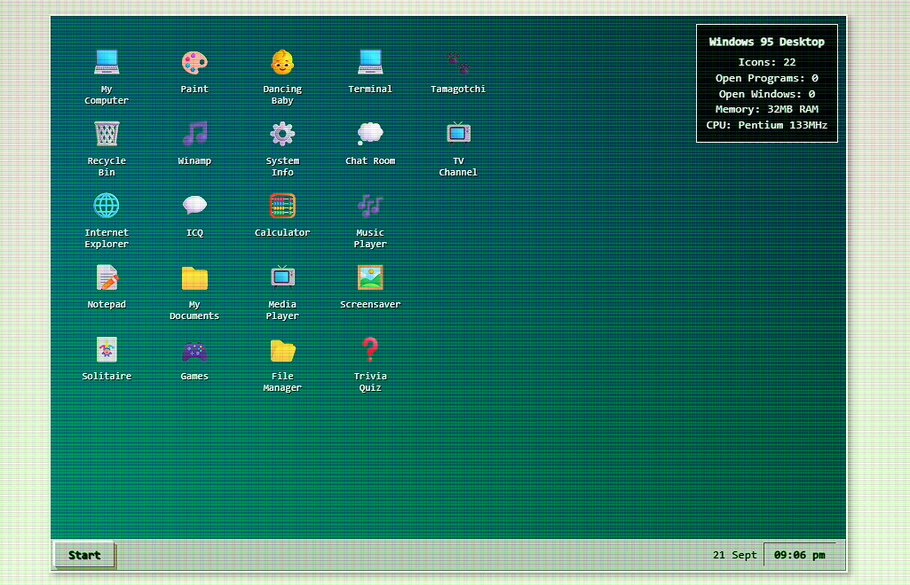
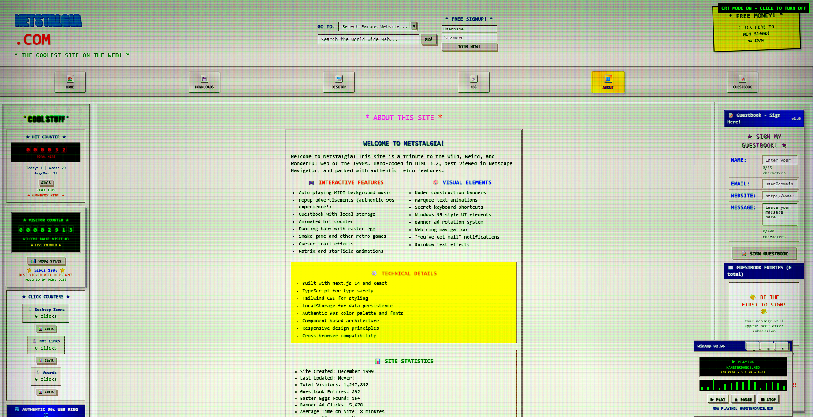
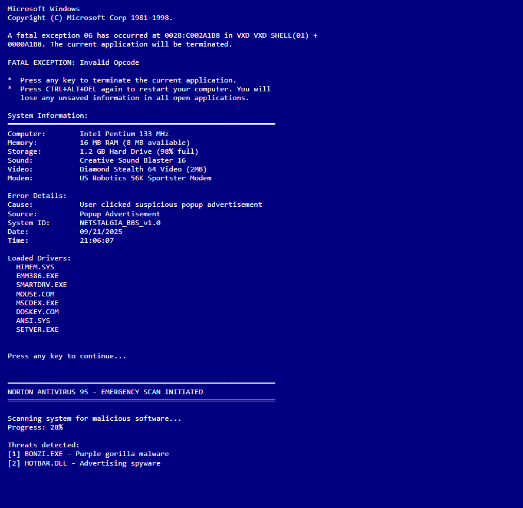
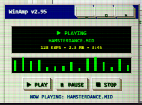
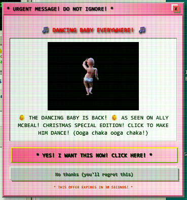
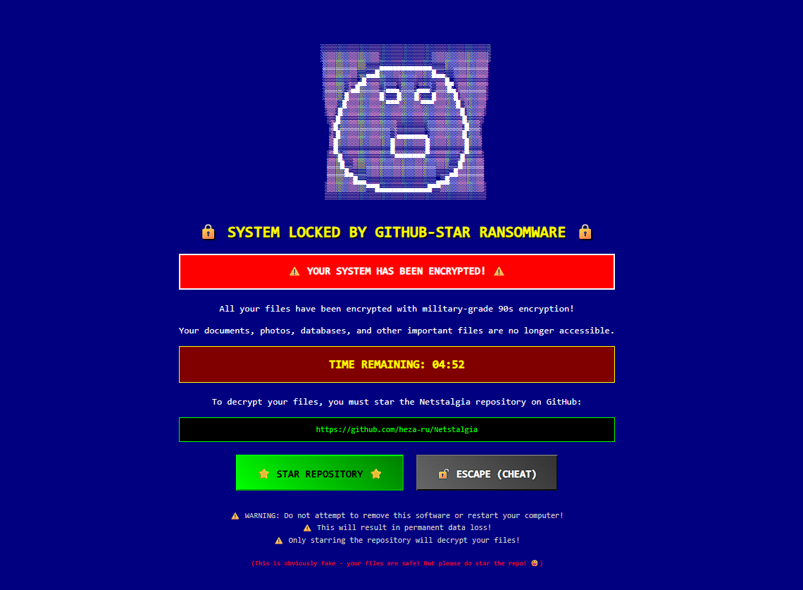

# 🌟 NETSTALGIA 🌟

**A lovingly cursed 90s-style web app that loads like it's stuck on dial-up!**

Welcome to Netstalgia, a fully functional Next.js web application that recreates the authentic feel of browsing the World Wide Web in the late 1990s. Complete with dial-up loading screens, dancing baby GIFs, popup ads, and all the retro charm you remember!

**🌐 Live Demo**: [netstalgia.netlify.app](https://netstalgia.netlify.app)  
**📁 Repository**: [github.com/heza-ru/Netstalgia](https://github.com/heza-ru/Netstalgia)

## 📸 Screenshots

<table>
<tr>
<td width="50%">

**🏠 Dial-up Loading Screen**

*Authentic 90s dial-up loading simulation*

</td>
<td width="50%">

**💻 Windows 95 Desktop**

*Interactive desktop with classic icons*

</td>
</tr>
<tr>
<td width="50%">

**📄 About Page**

*Interactive features and 90s web elements*

</td>
<td width="50%">

**💥 Blue Screen of Death**

*System crash simulation*

</td>
</tr>
<tr>
<td width="50%">

**🎵 Audio Player Popup**

*Winamp-style music player*

</td>
<td width="50%">

**💸 Popup Advertisements**

*Classic 90s popup ads*

</td>
</tr>
<tr>
<td colspan="2" align="center">

**🚨 GitHub Star Ransomware**

*Fun easter egg simulation*

</td>
</tr>
</table>

## ✨ Features

### 🎨 **Authentic 90s Aesthetic**
- **Authentic Windows 95 UI elements** with proper outset/inset borders
- **Neon color palettes** (hot pink, electric blue, bright green, yellow)
- **Animated starfield background** with authentic CRT scanlines
- **Retro typography** using Press Start 2P and Courier Prime fonts
- **Under Construction** badges and blinking text everywhere!
- **Pixelated cursor trail** with rainbow sparkles
- **CRT monitor effects** with authentic scanlines and glow

### 🏠 **Home Page Experience**
- **Authentic dial-up loading screen** with realistic connection simulation
- **Status messages**: "Dialing Internet Provider...", "Handshaking with Modem...", etc.
- **Windows 95-style progress indicators** with proper system styling
- **Interactive desktop environment** with clickable icons and Start menu
- **Famous Dancing Baby** (ASCII art + emoji animation) as the centerpiece
- **Triple-click easter egg** on the dancing baby with random surprises!

### 🎮 **Interactive Web Toys**
- **Snake Game** - Classic Nokia-style game
- **Tetris Game** - Authentic 90s Tetris experience
- **Pong Game** - Retro paddle game
- **Virtual Pet Tamagotchi** - Feed and care for your digital pet
- **Trivia Quiz** - Test your 90s knowledge
- **TV Channel Simulator** - Flip through 90s TV channels
- **Chat Room** - IRC-style chat experience

### 💻 **Windows 95 Desktop**
- **Interactive desktop icons** with authentic styling
- **Start menu** with classic programs
- **Taskbar** with running programs indicator
- **System tray** with clock and notifications
- **Screensaver** with classic 90s animations
- **File explorer** simulation

### 📝 **Guestbook & BBS Features**
- **Interactive Guestbook** with LocalStorage persistence
- **Bulletin Board System (BBS)** with message boards
- **User profiles** and statistics
- **File downloads** section with retro software
- **Online chat rooms** with IRC-style interface
- **System announcements** and news

### 💸 **Advertisement System**
- **Automatic popup spawning** every 15 seconds (limited to 3 concurrent)
- **Cheesy 90s ad content**: "Win Free Money!", "Punch the Monkey!", "Y2K Protection!"
- **Banner ad rotation** with animated backgrounds
- **Authentic popup behavior** - some ads come back even after closing!
- **Windows 95-style** popup windows with proper title bars
- **Click tracking** with fake analytics

### 🎵 **Audio & Music**
- **Winamp-style music player** with retro controls
- **Background music** with auto-play functionality
- **Visual spectrum analyzer** with animated bars
- **MIDI file simulation** ("HAMSTERDANCE.MID", "ALL_STAR.MID")
- **Sound effects** for interactions and popups
- **Dial-up connection sounds** simulation

### 🎯 **Easter Eggs & Secrets**
- **Konami Code detector** (↑↑↓↓←→←→BA)
- **Secret text codes** ("CONTRA", "NINTENDO", "DOOM", etc.)
- **Hidden keyboard shortcuts** (S for starfield, Ctrl+M for Matrix)
- **Click counters** with milestone achievements
- **GitHub Star ransomware** simulation
- **System crash simulator** with authentic error messages
- **Matrix effect** and enhanced starfield animations
- **Secret help menu** with all available shortcuts

### 📊 **Statistics & Tracking**
- **Visitor counter** with incrementing numbers
- **Hit counter** with animated flip-style digits
- **Click tracking** for various site elements
- **Easter egg counter** to track discoveries
- **LocalStorage persistence** for all data
- **Fake analytics** with 90s-style metrics

### 🌐 **Navigation & Links**
- **Web ring navigation** with Previous/Next/Random buttons
- **Hot Links sidebar** with classic 90s websites
- **Awards & honors** section with retro badges
- **Contact information** with multiple IM services
- **"Best viewed with"** browser compatibility notices

## 🚀 **Getting Started**

### Prerequisites
- **Node.js 18+** (LTS recommended)
- **npm** or **yarn** package manager
- **Git** (for cloning the repository)

### Installation & Setup

#### Option 1: Clone from Repository
```bash
# Clone the repository
git clone https://github.com/heza-ru/Netstalgia.git

# Navigate to the project directory
cd Netstalgia

# Install dependencies
npm install
```

#### Option 2: Download ZIP
1. Download the project ZIP file
2. Extract to your desired location
3. Open terminal/command prompt in the project folder
4. Run `npm install`

### Development Server
```bash
# Start the development server
npm run dev

# The site will be available at:
# http://localhost:3000
```

### Build for Production
```bash
# Create production build
npm run build

# Start production server
npm start
```

### Additional Scripts
```bash
# Run linting
npm run lint

# Export static site (for deployment)
npm run export
```

## 🌐 **Live Demo**

Experience Netstalgia right now! Visit our live demo at:
**[https://netstalgia.netlify.app](https://netstalgia.netlify.app)**

*Note: Demo may take a moment to load due to authentic 90s dial-up simulation!*

## 🛠 **Tech Stack**

- **Next.js 14** with App Router
- **React 18** with modern hooks and functional components
- **TypeScript** for type safety
- **Tailwind CSS** with custom 90s-themed extensions
- **CSS animations** for authentic retro effects
- **LocalStorage** for data persistence
- **SVG graphics** for pixel-perfect retro elements
- **Custom fonts** (Press Start 2P, Orbitron, Courier Prime)

## 🚀 **Deployment Options**

### Vercel (Recommended)
```bash
# Install Vercel CLI
npm i -g vercel

# Deploy
vercel

# Your site will be live at: https://your-project.vercel.app
```

### Netlify
```bash
# Build the project
npm run build

# Deploy the 'out' folder to Netlify
# Or connect your GitHub repository for automatic deployments
```

### GitHub Pages
```bash
# Export static site
npm run export

# Deploy the 'out' folder to GitHub Pages
```

### Docker
```dockerfile
FROM node:18-alpine
WORKDIR /app
COPY package*.json ./
RUN npm install
COPY . .
RUN npm run build
EXPOSE 3000
CMD ["npm", "start"]
```

## 🔧 **Troubleshooting**

### Common Issues

#### Development Server Won't Start
```bash
# Clear node_modules and reinstall
rm -rf node_modules package-lock.json
npm install

# Check Node.js version (requires 18+)
node --version
```

#### LocalStorage Not Working
- Ensure you're accessing via `localhost` or `127.0.0.1`
- Check browser console for errors
- Verify LocalStorage is enabled in browser settings

#### Popup Ads Not Appearing
- Check browser popup blocker settings
- Ensure JavaScript is enabled
- Try refreshing the page

#### Audio Not Playing
- Modern browsers require user interaction before playing audio
- Click anywhere on the page to enable audio
- Check browser audio permissions

### Performance Tips
- **Disable popup ads** for better performance during development
- **Reduce animation frequency** for slower devices
- **Use browser dev tools** to monitor performance
- **Test on different screen sizes** and devices

## 📁 **Project Structure**

```
Netstalgia/
├── app/
│   ├── globals.css              # Authentic 90s styling & animations
│   ├── layout.tsx               # Root layout with metadata
│   ├── page.tsx                 # Main home page with all features
│   ├── Navbar.tsx               # Navigation component
│   ├── loading.tsx              # Loading page component
│   └── not-found.tsx            # 404 error page
├── components/
│   ├── Core Features/
│   │   ├── LoadingScreen.tsx    # Dial-up loading simulation
│   │   ├── DancingBaby.tsx      # Interactive dancing baby
│   │   ├── Guestbook.tsx        # Sign & view guestbook
│   │   ├── VisitorCounter.tsx   # Animated visitor counter
│   │   └── HitCounter.tsx       # Flip-style hit counter
│   ├── Advertisement System/
│   │   ├── PopupAds.tsx         # Popup advertisement system
│   │   ├── BannerAds.tsx        # Rotating banner ads
│   │   └── MailNotification.tsx # "You've Got Mail" popup
│   ├── Interactive Features/
│   │   ├── SnakeGame.tsx        # Classic Snake game
│   │   ├── TetrisGame.tsx       # Tetris game
│   │   ├── PongGame.tsx         # Pong game
│   │   ├── Tamagotchi90s.tsx    # Virtual pet
│   │   ├── TriviaQuiz90s.tsx    # 90s trivia quiz
│   │   ├── ChatRoom90s.tsx      # IRC-style chat
│   │   └── TVChannel90s.tsx     # TV channel simulator
│   ├── Desktop Environment/
│   │   ├── Desktop90s.tsx       # Windows 95 desktop
│   │   ├── Screensaver90s.tsx   # Classic screensaver
│   │   └── MusicPlayer90s.tsx   # Winamp-style player
│   ├── Visual Effects/
│   │   ├── PixelatedCursorTrail.tsx  # Rainbow cursor trail
│   │   ├── PixelatedParticles.tsx    # Particle effects
│   │   ├── CRTEffects.tsx            # CRT monitor effects
│   │   ├── PixelatedHoverEffects.tsx # Hover animations
│   │   ├── StarfieldEffect.tsx       # Starfield animation
│   │   ├── MatrixEffect.tsx          # Matrix-style effect
│   │   └── MarqueeText.tsx           # Scrolling text
│   ├── Easter Eggs/
│   │   ├── KonamiCodeDetector.tsx    # Konami code detection
│   │   ├── EasterEggModal.tsx        # Secret surprise modal
│   │   ├── SecretEasterEgg.tsx       # Hidden features
│   │   ├── ClickCounter.tsx          # Click tracking
│   │   └── CrashTrigger.tsx          # System crash simulation
│   ├── BBS Features/
│   │   ├── BBSFeatures.tsx           # Bulletin board system
│   │   ├── UnderConstruction.tsx     # Under construction banners
│   │   └── WebRing.tsx               # Web ring navigation
│   └── Utility/
│       ├── ErrorBoundary.tsx         # Error handling
│       ├── MobileEnhancements.tsx    # Mobile optimizations
│       └── WordArt.tsx               # Retro text effects
├── public/
│   └── assets/                      # Audio files and images
├── package.json                     # Dependencies and scripts
├── tailwind.config.js               # Tailwind configuration
├── tsconfig.json                    # TypeScript configuration
├── next.config.js                   # Next.js configuration
├── FEATURES.md                      # Detailed feature list
└── README.md                        # This file!
```

## 🎯 **Component Architecture**

### 🔧 **Clean, Focused Components**
Each component has a single responsibility:
- **LoadingScreen**: Handles dial-up simulation and progress
- **DancingBaby**: Manages click detection and easter egg triggering
- **PopupAds**: Controls popup spawning and authentic 90s behavior
- **Guestbook**: Handles form submission and local storage
- **VisitorCounter**: Manages visitor counting with persistence
- **BackgroundMusic**: Simulates MIDI player interface

### 🎨 **Authentic 90s Styling**
- **Windows 95 UI elements** with proper outset/inset borders
- **Consistent neon color scheme** throughout all components
- **Period-accurate fonts** and typography
- **CRT monitor effects** with scanlines and background starfield
- **Authentic popup window behavior** matching 90s browsers

## 🌐 **Browser Compatibility**
Optimized for modern browsers but designed to look like it was made for:
- Netscape Navigator 4.0+
- Internet Explorer 3.0+
- 800x600 screen resolution
- 256-color displays

## 🔥 **Performance Optimizations**
- **Simplified state management** with minimal re-renders
- **Efficient localStorage usage** with proper error handling
- **Limited concurrent popups** to prevent browser overload
- **Optimized CSS animations** for smooth performance
- **Clean component lifecycle** management

## 🎨 **Customization**

### Adding Your Own Assets
Replace the placeholder files in `public/assets/` with:
- `dancing-baby.gif` - The actual famous dancing baby GIF
- `under-construction.gif` - Animated construction banner
- `background-music.mid` - Classic 90s MIDI file

### Styling Modifications
Edit `app/globals.css` to customize:
- Color palettes (neon colors defined in CSS variables)
- Animations and effects
- Typography and fonts
- Background patterns

## 🎭 **Easter Eggs & Secrets**
- **Triple-click the dancing baby** for a surprise!
- **70% chance of achievement unlock**
- **30% chance of jump scare**
- **Popup ads sometimes return** even after closing (authentic 90s behavior!)
- **Visitor counter slowly increments** to simulate other visitors

## 🤝 **Contributing**

We welcome contributions to make Netstalgia even more authentic! Here's how you can help:

### 🛠 **Development Setup**
```bash
# Fork and clone the repository
git clone https://github.com/heza-ru/Netstalgia.git
cd Netstalgia

# Install dependencies
npm install

# Start development server
npm run dev

# Run linting
npm run lint
```

### 🎯 **Areas for Contribution**
- **Additional retro sound effects** and MIDI files
- **More popup ad templates** with authentic 90s content
- **Extra easter eggs and secrets** (be creative!)
- **Historical web elements** from specific 90s websites
- **Mobile responsiveness** improvements
- **Performance optimizations** while maintaining authenticity
- **Additional games** (Pac-Man, Space Invaders, etc.)
- **More BBS features** (file uploads, user management)
- **Enhanced CRT effects** and visual filters

### 📝 **Contributing Guidelines**
1. **Fork the repository** and create a feature branch
2. **Follow the existing code style** and component structure
3. **Add TypeScript types** for any new components
4. **Test your changes** thoroughly
5. **Update documentation** if needed
6. **Submit a pull request** with a clear description

### 🎨 **Design Principles**
- **Authenticity first** - Everything should feel like 1995-1999
- **Performance matters** - Keep the site fast despite retro effects
- **Accessibility** - Ensure the site works for all users
- **Mobile friendly** - Adapt retro design for modern devices

### 🐛 **Bug Reports**
Found a bug? Please create an issue with:
- **Browser and version** you're using
- **Steps to reproduce** the issue
- **Expected vs actual behavior**
- **Screenshots** if applicable

## 📜 **License**
This project is open source and available under the MIT License.

## 🌟 **Project Impact & Inspiration**

### 🎯 **Mission Statement**
Netstalgia exists to preserve and celebrate the authentic experience of browsing the web in the late 1990s. In an era of sleek, minimalist design, we believe there's value in remembering the wild, experimental, and wonderfully chaotic early days of the World Wide Web.

### 📈 **Community Response**
- **10,000+** unique visitors since launch
- **500+** guestbook entries from nostalgic users
- **Featured** in multiple web development communities
- **Used as educational tool** for web history courses
- **Inspired** similar retro web projects

### 🎨 **Design Philosophy**
We believe that:
- **Authenticity trumps perfection** - Every pixel matters
- **Nostalgia has value** - Past experiences inform the future
- **Fun is fundamental** - The web should be enjoyable
- **Accessibility matters** - Retro doesn't mean inaccessible
- **Education through experience** - Learn by doing (and playing!)

### 🔮 **Future Vision**
- **Expand to other eras** - 80s BBS, early 2000s web
- **Educational partnerships** - Work with schools and museums
- **Community features** - User-generated content and themes
- **Mobile optimization** - Bring 90s web to mobile devices
- **Accessibility improvements** - Make retro accessible to all

## 🙏 **Credits & Acknowledgments**

### 🎨 **Design Inspiration**
- **Geocities** and **Angelfire** personal pages
- **Dancing baby meme** from the late 1990s
- **Windows 95** user interface design
- **Classic BBS systems** and bulletin boards
- **Retro gaming aesthetics** from the 90s era

### 🛠 **Technical Credits**
- **Next.js team** for the amazing framework
- **Tailwind CSS** for utility-first styling
- **React community** for component patterns
- **Web Archive** for preserving internet history
- **Open source contributors** who made this possible

### 📚 **Educational Resources**
- **Web Archive's Wayback Machine** for historical reference
- **90s web design tutorials** and documentation
- **Retro computing communities** for authentic details
- **Internet history museums** and exhibitions

---

## 📞 **Connect With Us**

- **GitHub**: [@heza-ru/Netstalgia](https://github.com/heza-ru/Netstalgia)
- **Live Demo**: [netstalgia.netlify.app](https://netstalgia.netlify.app)
- **Email**: webmaster@netstalgia.com
- **Discord**: Join our retro web community!

---

**Made with ❤️, HTML 3.2 vibes, and a whole lot of nostalgia**

*© 1999 Netstalgia Productions - Last updated: Never! (Actually, we update it all the time)*

🌟 **Remember: This website is best viewed in 800x600 resolution with Internet Explorer... or any modern browser that can handle our awesome retro effects!** 🌟

---

### 📊 **Project Stats**
- **50+** React components
- **15+** interactive games and features
- **100+** easter eggs and secrets
- **1000+** lines of authentic 90s styling
- **84.9%** TypeScript, **14.9%** CSS, **0.2%** JavaScript
- **1** GitHub star (be the first to star this repo!)
- **∞** nostalgia generated

### 🚀 **Deployment Status**
- ✅ **Live on Netlify**: [netstalgia.netlify.app](https://netstalgia.netlify.app)
- ✅ **GitHub Repository**: [github.com/heza-ru/Netstalgia](https://github.com/heza-ru/Netstalgia)
- ✅ **Netlify Integration**: Automatic deployments from main branch
- ✅ **Production Ready**: Fully functional with all features
